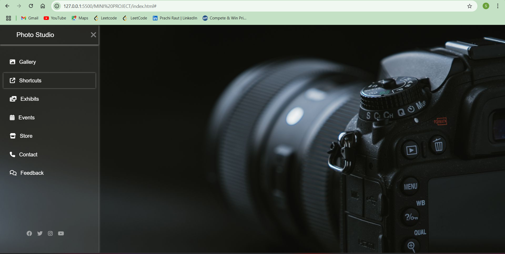

# 📸 Photo Studio - Sidebar Navigation Layout

This project is a **Photo Studio web interface** designed with a sleek sidebar navigation menu and a visually appealing fullscreen background. It's built using **HTML** and **CSS**, perfect for learning or demonstrating UI/UX design concepts.

---

## 📸 Screenshot

---

## 🧩 Features

- Vertical sidebar with navigation icons
- Responsive and clean layout
- Hover effects and icon support
- Sections like:
  - 📁 Gallery
  - 🔗 Shortcuts
  - 🖼️ Exhibits
  - 📅 Events
  - 🛒 Store
  - ☎️ Contact
  - 💬 Feedback
- Social media links in the sidebar footer
- Fullscreen hero background image

---

## 🛠️ Tech Stack

- **HTML5** – structure
- **CSS3** – layout & styling

